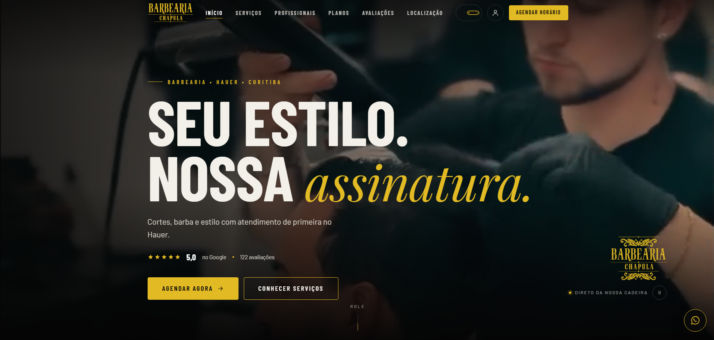

<p align="center">
  
</p>

<p align="center">
  
  
  
  
</p>

<p align="center">
  Site de apresentação para a <b>Barbearia Chapula</b>, pensado para transformar visitantes em clientes:
  o usuário conhece os serviços, escolhe o estilo, vê os preços e agenda direto pelo WhatsApp.
</p>

<p align="center">
  <a href="https://lorenzo-or7.github.io/barbearia-chapula-demo/"><b>🔗 Acessar o site</b></a>
</p>

---

## 🖥️ Preview

<!-- Envie um print do site com o nome preview.png para esta imagem aparecer -->
<p align="center">
  
</p>

---

## ✨ Funcionalidades

- 💈 **Serviços e preços:** degradê, social, tesoura e corte + barba, com valor e duração
- 🎯 **"Qual é o seu estilo?":** o cliente escolhe um corte e agenda aquele estilo com um clique
- 💳 **Planos de assinatura:** comparação entre preço avulso e plano mensal, mostrando a economia
- 👥 **Profissionais:** apresentação da equipe
- 🖼️ **Galeria:** trabalhos feitos na barbearia
- ⭐ **Avaliações:** nota e quantidade de avaliações do Google
- 📍 **Localização:** mapa integrado, rota pelo Google Maps e horários de funcionamento
- 📲 **Agendamento pelo WhatsApp** em todos os pontos de ação do site
- 📱 **Layout responsivo** para celular, tablet e desktop

---

## 🛠️ Tecnologias

- **HTML5** semântico, dividido em seções
- **CSS3** para layout responsivo e identidade visual
- **JavaScript** puro para as interações da página
- **GitHub Pages** para hospedagem

---

## ⚙️ Como rodar

Não precisa instalar nada: baixe o repositório e abra o arquivo `index.html` no navegador.

```bash
git clone https://github.com/lorenzo-or7/barbearia-chapula-demo.git
```

---

## 👨‍💻 Autor

<p>
  Feito por <b>Lorenzo Orsetti</b><br/>
  <a href="https://www.linkedin.com/in/lorenzo-orsetti-031906349/">
    
  </a>
  <a href="https://github.com/lorenzo-or7">
    
  </a>
</p>

<p align="center">
  
</p>
